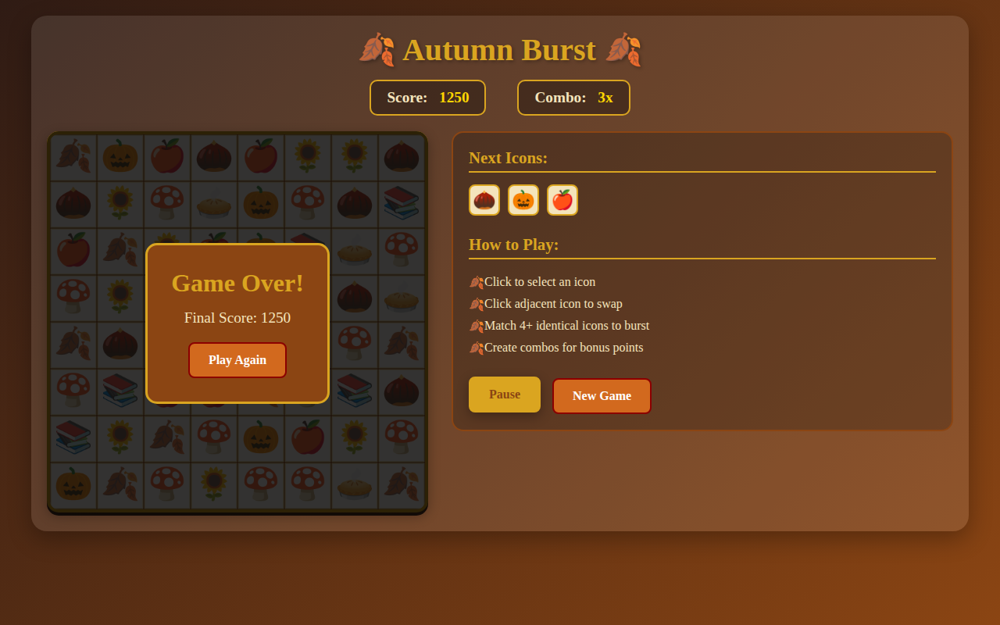

# 🍂 Autumn Burst - Fall Match-4 Puzzle Game 🍂

A delightful fall-themed match-4 puzzle game inspired by Bubble Block and Tetris mechanics. Match 4 or more identical autumn icons to make them burst and score points!

## 📸 Screenshots

### Desktop Views
| Initial Game State | Active Gameplay with Scoring |
|:--:|:--:|
|  |  |
| Fresh game start with colorful autumn icons | Mid-game showing score of 750 and 3x combo multiplier |

| Paused State | Game Over Screen |
|:--:|:--:|
|  |  |
| Game paused with Resume button active | End game screen showing final score of 1250 |

### Mobile Responsive
| Mobile Portrait View |
|:--:|
|  |
| Responsive design optimized for mobile devices |

## 🎮 Game Features

### Core Mechanics
- **Match-4 System**: Form clusters of 4 or more identical fall-themed icons
- **Burst & Score**: Matched icons burst with satisfying animations and award points
- **Gravity Physics**: Icons fall down to fill gaps after bursts occur
- **Chain Reactions**: Create combos for bonus points when new matches form after gravity
- **Progressive Scoring**: Larger clusters and combo chains award more points

### Fall Theme
- **Autumn Icons**: Beautiful fall-themed symbols including:
  - 🍂 Maple leaves
  - 🎃 Pumpkins  
  - 🌰 Acorns
  - 🍎 Apples
  - 🍄 Mushrooms
  - 🌻 Sunflowers
  - 🥧 Pies
  - 📚 Books (back-to-school theme)

- **Seasonal Palette**: Warm autumn colors (burnt orange, deep red, gold, brown)
- **Cozy Atmosphere**: Rich background gradients and autumn-inspired styling

### Gameplay Features
- **Real-time Scoring**: Live score and combo tracking
- **Next Icons Preview**: See upcoming icons
- **Game Controls**: Pause, restart, and new game functionality
- **Mobile Responsive**: Perfect for both desktop and touch devices
- **Achievement System**: Special celebrations for milestones

## 🚀 How to Play

1. **Objective**: Click anywhere on the game board to trigger match detection
2. **Matching**: The game automatically finds clusters of 4+ identical icons
3. **Scoring**: Matched clusters burst and award points based on size
4. **Combos**: Chain reactions multiply your score
5. **Strategy**: Plan your moves to create larger clusters and combo chains

## 🛠️ Installation & Setup

### Quick Start
1. Clone or download this repository
2. Open `index.html` in any modern web browser
3. Start playing immediately - no installation required!

### Local Development Server
For development or testing, you can run a local server:

```bash
# Using Python (most systems)
python3 -m http.server 8000

# Using Node.js (if you have http-server installed)
npx http-server

# Using PHP (if available)
php -S localhost:8000
```

Then open http://localhost:8000 in your browser.

## 🎯 Game Controls

- **Click**: Trigger match detection and processing
- **Pause**: Pause/resume the game
- **New Game**: Start fresh with a new random board
- **Mobile**: Touch-friendly for mobile devices

## 🏆 Scoring System

- **Base Points**: 10 points per icon in a matched cluster
- **Combo Multiplier**: Each consecutive combo increases the multiplier
- **Cluster Size Bonus**: Larger clusters award more points
- **Achievement Milestones**: Special celebrations at score milestones

## 📱 Mobile Support

The game is fully responsive and optimized for mobile devices:
- Touch-friendly controls
- Responsive layout that adapts to screen size
- Portrait mode optimization for phones
- Smooth touch interactions

## 🎨 Technical Details

- **Frontend**: HTML5 Canvas, CSS3, Vanilla JavaScript
- **No Dependencies**: Pure web technologies, no frameworks required
- **Cross-Platform**: Works on all modern browsers
- **Performance**: Optimized for smooth 60fps gameplay
- **Accessibility**: Clean, readable interface with good contrast

## 🎃 Seasonal Variations

This game is designed with fall/autumn theme, but the architecture supports:
- Easy icon replacement for other seasons
- Color palette customization
- Theme-specific animations and effects

## 🔧 Development

### File Structure
```
├── index.html      # Main game HTML
├── styles.css      # Autumn-themed styling
├── game.js         # Core game logic and mechanics
├── README.md       # This file
└── .gitignore      # Git ignore patterns
```

### Key Components
- **AutumnBurstGame Class**: Main game engine
- **Canvas Rendering**: Smooth 60fps graphics
- **Match Detection**: Flood-fill algorithm for cluster detection
- **Animation System**: Smooth transitions and effects
- **Responsive Design**: Mobile-first CSS layout

## 🍁 Contributing

Feel free to contribute improvements:
- Additional autumn icons or themes
- Sound effects and audio
- New game modes or difficulty levels
- Performance optimizations
- Mobile enhancements

## 📄 License

This project is open source. Feel free to use, modify, and distribute as needed.

---

**Happy gaming and enjoy the autumn vibes! 🍂🎮**
